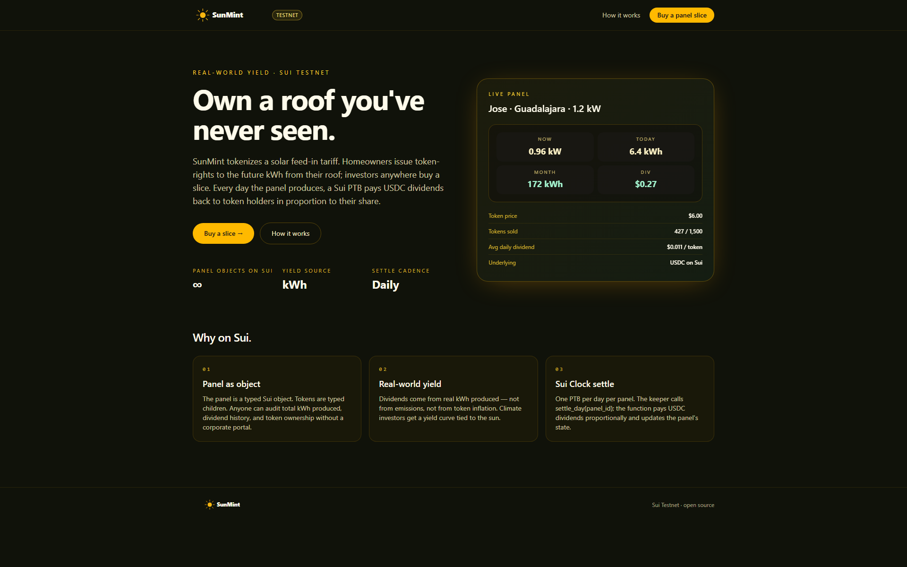
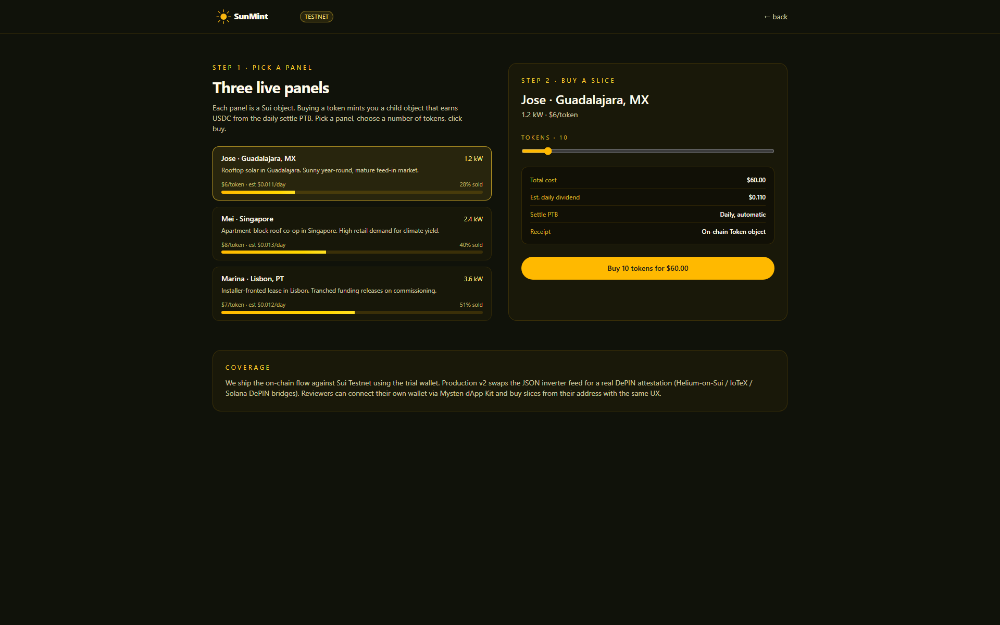

<p align="center">
  
</p>

<p align="center">
  <b>SunMint</b> — Own a slice of a solar roof — USDC dividends paid daily.
</p>

<p align="center">
  <a href="https://sunmint.veithly.workers.dev"></a>
  <a href="https://sunmint.veithly.workers.dev/app"></a>
  <a href="https://nextjs.org"></a>
  <a href="https://sui.io"></a>
  <a href="./LICENSE"></a>
</p>

<p align="center">
  
</p>

## Why SunMint

Rooftop solar is one of the highest-return small-scale infrastructure investments — but the capital is locked into the homeowner's balance sheet, and the dividend (the daily feed-in tariff) is illiquid. SunMint tokenizes the feed-in tariff. Homeowners issue token-rights to the future kWh from their roof; investors anywhere buy a slice; every day the panel produces, a Sui PTB pays USDC dividends back to token holders in proportion to their share.

## What it does

Open the app. Browse the roof marketplace — each listing shows the panel kWh history, location, expected yield, and the share price in USDC. Pick one. Click Buy. The trial wallet path runs the demo; connect for real ownership.

The daily oracle posts the panel's kWh production. The dividend PTB splits the day's revenue across token holders proportionally. Open the holdings dashboard to see your daily inflow, your projected annual yield, and the on-chain receipt for every payout.

<p align="center">
  
</p>

## Architecture

Next.js 15 + Mysten dApp Kit. The Move `sunmint_core` module mints `RoofToken` shares against a `Roof` asset object; the daily settlement PTB reads a curated oracle and pays USDC proportionally. Full pipeline in [`docs/ARCHITECTURE.md`](./docs/ARCHITECTURE.md).

## Quick start

```bash
pnpm install
cp .env.example .env.local   # fill SUI_FULLNODE_URL + LLM key (see below)
pnpm dev                     # http://localhost:3200
```

Required env vars:
- `SUI_FULLNODE_URL` — Sui Testnet RPC endpoint (default: `https://fullnode.testnet.sui.io:443`)
- `SUI_DEMO_PRIVATE_KEY` — Ed25519 secret key for the hosted-wallet ("Try instantly") flow. Leave blank to require a connected wallet.
- `STEPFUN_API_KEY` (or `OPENAI_API_KEY`) — reasoning engine key, only required for the AI-driven flows.

Production build + Cloudflare deploy:

```bash
pnpm build
pnpm run deploy   # opennextjs-cloudflare deploy
```

End-to-end smoke test:

```bash
pnpm test:e2e
```

## Tech stack

- **Next.js 15** App Router · React 19 · Tailwind v4 · shadcn/ui base
- **@mysten/dapp-kit-react** for wallet connection + transaction signing
- **@mysten/sui** for PTB construction + RPC
- **OpenNext** for Cloudflare Workers deployment
- **Playwright** for end-to-end test coverage

## License

MIT © veithly
