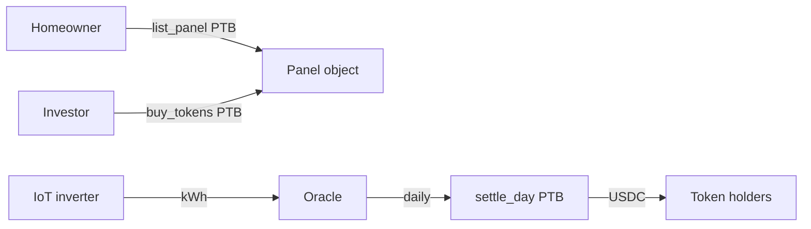

# SunMint

### Tokenize your rooftop solar. Earn USDC per kWh.

*Homeowners crowdfund panels with global retail investors. Daily settle in USDC. On Sui.*

> **Regulatory disclaimer:** SunMint tokens are forward-revenue-share contracts, not equity. Availability depends on jurisdiction. Pilot panels are in Bolivia and Kenya.

[](https://sunmint.app/marketplace)
[](https://overflow.sui.io/)
[](#)

**Quick links:**
[Combined Pitch+Demo](./pitch/recording/combined.mp4) ·
[Marketplace](https://sunmint.app/marketplace) ·
[PRD](./project_prd.md)

---

## Why SunMint is different

| | Bank loan | Solar lease | DeFi yield | **SunMint** |
| --- | --- | --- | --- | --- |
| Homeowner upfront | 0 (debt) | 0 (lease) | n/a | **0 (token sale)** |
| Investor yield source | n/a | n/a | emissions | **real kWh sold** |
| Global retail access | n/a | n/a | yes | **yes** |
| Audit trail | bank | lease co. | n/a | **on-chain kWh + dividend** |

## Hero moment

```
0:00 Jose lists 1.2 kW panel — €6/token, 1500 tokens
0:01 Click Publish — PTB digest
0:02 Panel appears on marketplace with live kW gauge
0:03 Mei buys 10 tokens for $20
0:05 Mei's dividend counter ticks +$0.011 USDC for today
```

## How it works



## Track fit — Explorations

| Rubric | Hit |
| --- | --- |
| RWA | Physical solar panels |
| DePIN | Inverter data → on-chain settle |
| Global asset coordination | Singapore investor funds Mexico panel |
| Sui object model | Panel + Token + DividendPool |
| Mass adoption | Homeowner + climate retail audiences |

## License
MIT.
